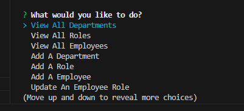

# Employee-Tracking

## Description

This code is for storing a company's data into a database. The user can view what's inside the database, add information into the database, update information, and delete any unneeded information from the database too.

## Table of Contents

- [Installation](#installation)
- [Usage](#usage)
- [License](#license)
- [Features](#features)

## Installation

inquirer and mysql2 is installed into this project for functioning

## Usage

 
[Click here to see Deployed Application](https://watch.screencastify.com/v/xezSbRPqhQk5lrOmhP8x)

## License

N/A

## Features

-Viewing Information in the Database 
-Adding information in the Database 
-Updating Information in the Database 
-Delete Information in the Database 
-Exit
